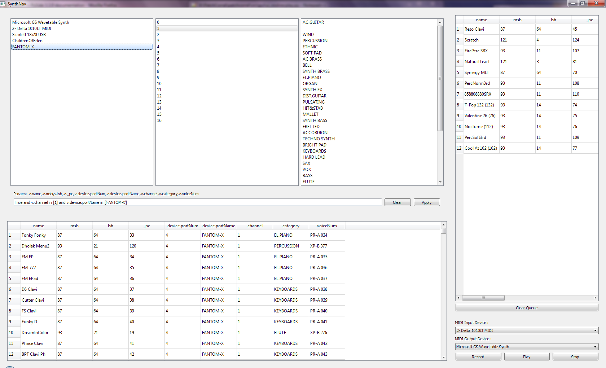

PatchCorral
===========
This is a program I've written to bring my Roland Fantom-XR into a more manageable environment (and other synthesizers, in time).  It uses an interface similar to what you would find in a media player program to allow users to easily work down the patches to find that perfect sound from their library.  It also enables the user to do WireShark-style filters on the patch list for more advanced queries.



Right now, the filtering and queueing of patches is all working.  The next features to implement include:
 - Add "star" button for favoriting patches.
 - Roland Fantom-XR: Add support for Rhythm patches
 - "Speed Search" mode that will automatically step through the patches and let the user delete patches from the queue as it goes.

License
=======
GNU GPL v3 (http://www.gnu.org/licenses/#GPL)

Installation
============
This project requires:
 - Python 3.3 (requires "enum" and implicit namespace packages CAUSE THEY'RE AWESOME)
 - "python-rtmidi" v0.4b (https://pypi.python.org/pypi/python-rtmidi)
 - PySide
 - PyYAML (http://pyyaml.org/wiki/PyYAML)

Usage
=====
While I would love to convert this to a VST, at the moment this is a utility program.  Since the Roland Fantom-XR has two MIDI inputs, I usually route this to the USB (detectable) and route my DAW activity through the standard MIDI port using a separate MIDI output device.  This works well enough so I don't have a huge urge to get into VST-land, especially since VST2 libraries are no longer available and Reaper doesn't yet support VST3 (grrrr......).

To run:
1. Execute "bin/synthnav.py".
2. If everything works well, you'll get a window with your current MIDI output devices and General MIDI instruments mapped to them that you can then filter and select.
    a.  Double-click or press "Enter" in the filtered voice list to move the selected patch(es) to the queue view.
    b.  From the queue view, press "Enter" to issue the program change event to the underlying device/channel.
    c.  From the queue view, press "Delete" to remove the voice from the list.
    d.  MIDI recording/playback is disabled right now because it locks up MIDI input devices from use by DAWs.

To add new voice lists:
1. Launch and then close PatchCorral so "bin/userdata.yml" is created.
2. Open "bin/userdata.yml" in your favorite text editor.
3. Populate "voicelists" with any new names you'd like.  For example:
    ```yaml
    voiceLists:
      favorites:
      - !!python/object:patchcorral.src.engine.mididevice.MIDIVoice {category: SYNTH BASS,
        channel: 1, deviceName: FANTOM-X, lsb: 4, msb: 93, name: Flat SawBass, pc: 48,
        voiceNum: XP-D 049}
      - !!python/object:patchcorral.src.engine.mididevice.MIDIVoice {category: SYNTH BASS,
        channel: 1, deviceName: FANTOM-X, lsb: 4, msb: 93, name: 808 Bass, pc: 33, voiceNum: XP-D
          034}
      mysong1: []
      mysong2: []
    ```
    ...adds 2 new voice lists "mysong1" and "mysong2" alongside your "favorites" list.

To delete voice lists:
1. Close PatchCorral if it's running.
2. Open "bin/userdata.yml" in you favorite text editor.
3. Delete the lists from the "voiceLists" map that you don't want anymore and save.
